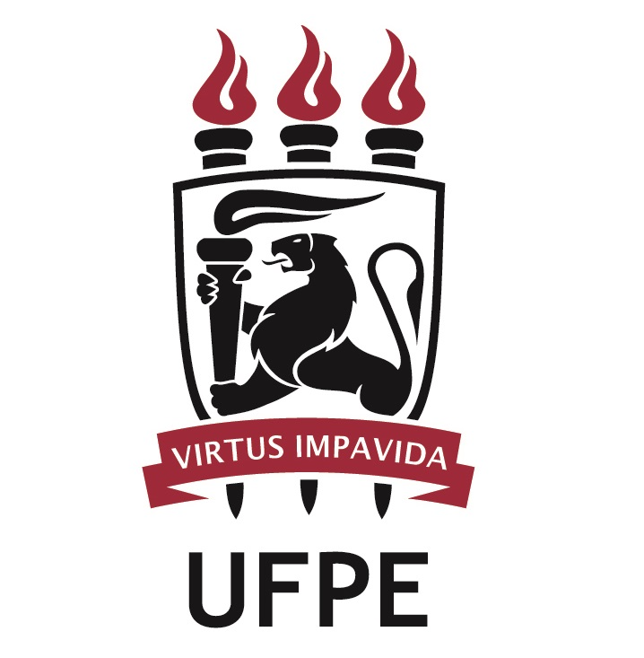

<!---
<a href="#register">Register</a> | <a href="#program">Program</a> | <a href="#logistics">Logistics</a>
-->
---
 

# Latin American Political Methodology Meeting, 2023

The seventh Latin American Polmeth (LAPolMeth) meeting will take place on-site on November 17-18th, 2023 in Recife, Brazil. The meeting is hosted by Universidade Federal de Pernambuco (UFPE) and sponsored by the Society for Political Methodology, Princeton University, and the University of North Carolina at Chapel Hill. 

The meeting will feature a limited number of paper workshops, a poster session for graduate students, and keynote talks by prominent political methodologist [‪Molly Offer-Westort](https://mollyow.github.io/) (University of Chicago) and [Noam Lupu](https://www.noamlupu.com/) (Vanderbilt University). Participants will have the option to participate in person or online. 

## Application process
The application process [will be open from June 1st to July 30th, 2023](https://www.cambridge.org/core/membership/spm/conferences). Those interested in attending must indicate paper title, author information, and an abstract not exceeding 3,000 characters. Graduate students must indicate their intention to participate in the poster session.

The organizing team will notify applicants of its decision on August 15, 2023. Applicants will then have the chance to register from August 15th through October 13th, 2023. 

There is a small registration fee of US$10 and US$20 for student and non-student SPM members and of US$25 and US$50 for non-members, respectively. Registration is available at the event's [Cambridge University Press website](https://www.cambridge.org/core/membership/spm/conferences).

To ensure that all participants have enough time to read their paper, participants are required to submit their papers no later than November 3rd, 2023. 

<!---
Authors will be provided with information on where to upload their manuscripts upon confirmation of acceptance.

## Registrarion
Registration for this event is now closed.
-->

## Program
The final version of the conference program will available on October 20th. 

## Event format
The event will feature parallel paper workshops, which will be restricted to registered participants. These sessions will consist of active discussions of previously circulated manuscripts; no presentation will take place. It is therefore imperative that all participants read the papers in advance and prepare feedback to ensure a lively and engaging discussion. 

<!---
To enable all participants to engage in productive conversation, authors are expected to submit complete drafts of their manuscripts no later than November 3rd, 2023. 
-->

There will be a total of two keynote presentations at the end of each day. These will be open to the public.

The poster session for graduate students will be held at lunchtime on Saturday, November 18th.

All talks, posters and sessions will be held in English. Attendees will have the option to participate virtually or in person. 

## Logistics, Local Transportation and Lodging 

### Information about visas: 

Invitation Letters were already sent to participants who need to apply for visas to travel to Brazil.  If you have not received an invitation letter, please contact us at latampolmeth@gmail.com

### Transportation options in Recife 

Both taxis and ride-sharing services (uber) can be convenient and safe ways to get to and from the airport.

When you arrive at the airport, collect your luggage and proceed to the airport's arrival area. Follow signs for "Desembarque" (Arrivals).

Using Taxis:
- Official Airport Taxis: Upon arriving at the airport, look for official airport taxis. These are typically well-marked and located in designated taxi stands. Avoid accepting rides from individuals who approach you inside the airport, as they might not be legitimate taxi drivers.
- Fare Estimate: Before getting into the taxi, ask the driver for an estimate of the fare to your destination. This can help you avoid any surprises when it comes to the cost.
- Receipts: Request a receipt from the taxi driver, which can be useful for reimbursement if your trip is business-related or for reference in case of any issues.
- Payment Methods: Check with the driver about the accepted payment methods. In Brazil, it's common to pay in cash, but some taxis also accept credit cards. Confirm this beforehand.
- Language Barrier: While some taxi drivers may speak English, it's helpful to have your destination address written down or saved on your phone in Portuguese to ensure a smooth ride.

Using Uber
- Recife's Guararapes-Gilberto Freyre International Airport offers free Wi-Fi for travelers. Connect to the airport's Wi-Fi network to request an Uber. 
- We recommend that participants use Uber VIP or Comfort options to ensure safer and well-maintained vehicles.

### Accommodation: 
Recife has many good hotels in Boa Viagem, the neighborhood where the LaPolmeth meeting will take place. Two of them offer discounts for participants: 

[Mar Hotel](https://www.marhotel.com.br/)
Rua Rua Barão de Souza Leão, 451 - Boa Viagem, Recife – PE, CEP 51030-300
Special Prices (please mention PROMO CODE VIILAPOLMETH) 
- Apart. Sgl/Standard   R$ 362 ,00 + 5% ISS 
- Apart. Dbl/Standard  R$ 416,00 + 5% ISS 
- Apart. Sgl/Executivo   R$ 398,00 + 5% ISS 
- Apart. Dbl/Executivo  R$ 457,00 + 5% ISS 

[Marante Plaza](https://marante.com.br/)
Av. Boa Viagem, 1070 - Boa Viagem, Recife - PE, CEP 51011-000
Special Prices (please mention that you are a guest of Departamento de Ciência Política da Universidade Federal de Pernambuco):
- Apart. Sgl/Standard   R$ 240 ,00 + 5% ISS (Por dia/ por apartamento)
- Apart. Dbl/Standard  R$ 270,00 + 5% ISS (Por dia/ por apartamento)
- Apart. Tpl/Standard  R$ 390,00 + 5% ISS (Por dia/ por apartamento)
- Apart. Sgl/Luxo   R$ 280,00 + 5% ISS (Por dia/ por apartamento)
- Apart. Dbl/Luxo  R$ 310,00 + 5% ISS (Por dia/ por apartamento)

### Places to visit
- Recife antigo (Rua do Bom Jesus, Paço do Frevo, Museu Cais do Sertão, Mercado de artesanato)
- Olinda (Alto da Sé)
- Francisco Brennand museum 
- Ricardo Brennand castle  
- Boa Viagem Beach: the lapolmeth meeting will take place in Boa Viagem beach. While the beach is beautiful and inviting, it's also known for occasional shark sightings and attacks. For your safety, avoid swimming there.
- Other beaches nearby: Paiva, Porto de Galinhas, Maracaípe, Serrambi e Carneiros. 

### Saturday night dinner 
- [Entre amigos praia](https://www.instagram.com/praiaentreamigos/)
- [Parraxaxá](https://www.instagram.com/parraxaxa/)

### Organizing team
- Gabriela Tarouco (UFPE)
- Nara Pavão (UFPE)
- Lorena Barberia (Universidade de São Paulo, Brazil)
- Germán Feierherd (UdeSA, Argentina)
- Carmen Le Foulon (Centro de Estudios Públicos, Chile)
- John Londregan (Princeton University, USA)
- Santiago López-Cariboni (Universidad de la República, Uruguay)
- Adrián Lucardi (ITAM, Mexico)
- Santiago Olivella (University of North Carolina at Chapel Hill, USA)

### Sponsors
   
