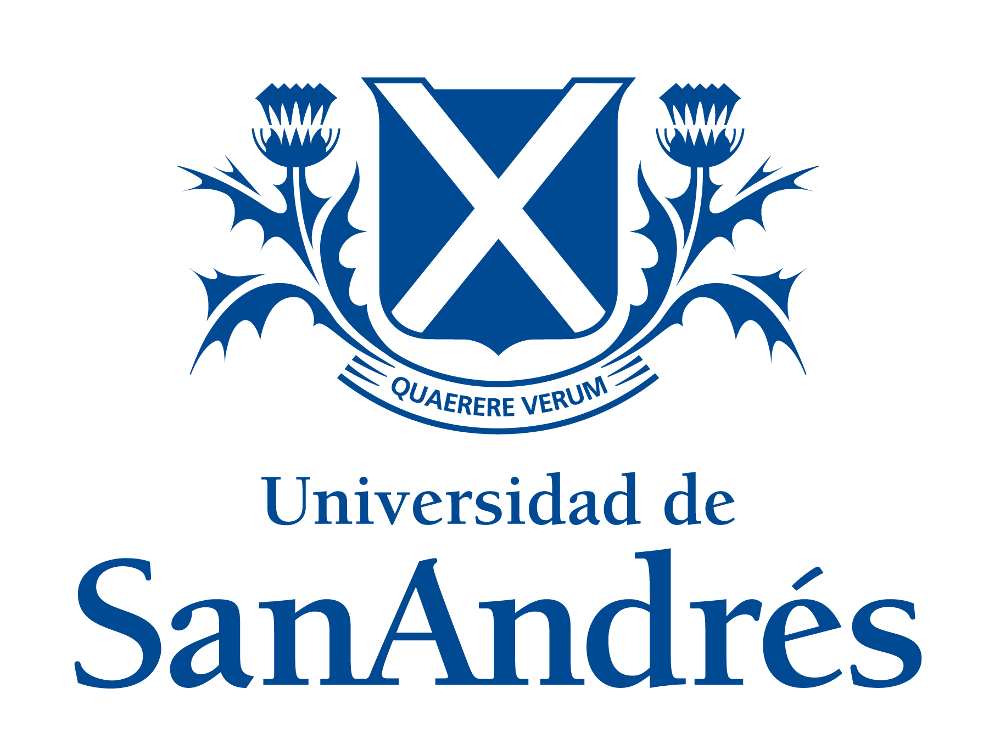

<!---
<a href="#register">Register</a> | <a href="#program">Program</a> | <a href="#logistics">Logistics</a>
-->
---
 

# Latin American Political Methodology Meeting, 2022

The sixth Latin American Polmeth (LAPolMeth) meeting will take place on-site on November 18-19, 2022 in Buenos Aires, Argentina. The meeting is hosted by Universidad de San Andres (UdeSA) and sponsored by the Society for Political Methodology, Princeton University, and the University of North Carolina at Chapel Hill. Participants will have the option to participate in person or online. 

The meeting will feature a limited number of paper workshops, a poster session for graduate students, and keynote talks by prominent political methodologists [Thad Dunning](http://www.thaddunning.com) (UC Berkeley) and [Vera Tröger](https://warwick.ac.uk/fac/soc/economics/staff/vetroeger/) (UHH).

## Application process
The application process [will be open through June 3, 2022](https://www.cambridge.org/core/membership/spm/conferences). Those interested in attending must indicate paper title, author information, and an abstract not exceeding 250 words. Graduate students must indicate their intention to participate in the poster session.

The organizing team will notify applicants of its decision on June 20, 2022. Applicants will then have the chance to register from June 20 through September 30, 2022. 

There is a small registration fee (US$10 and US$20 for student and non-student SPM members; US$25 and US$50 for non-members, respectively). To ensure that all participants have enough time to read their paper, participants are required to submit their papers no later than November 5, 2022.

<!---
## Registrarion
Registration for this event is now closed.

## Program
The final version of the conference program is available [here](https://docs.google.com/document/d/1PgdLx9iwLM0_QdtJYdM9nQTYmqK_S22gaB1ocCvOe88/edit?usp=sharing).
-->

### Event format
The event will feature parallel paper workshops, which will be restricted to registered participants. These sessions will consist of active discussions of previously circulated manuscripts; no presentation will take place. It is therefore imperative that all participants read the papers in advance and prepare feedback to ensure a lively and engaging discussion. To enable all participants to engage in productive conversation, authors are expected to submit complete drafts of their manuscripts no later than November 5, 2022. Authors will be provided with information on where to upload their manuscripts upon confirmation of acceptance.

There will be a total of two keynote presentations at the end of each day. These will be open to the public.

The poster session for graduate students will be held at lunchtime on Saturday, November 19.

All talks, posters and sessions will be held in English.

### Meeting location
The meeting will be held at UdeSA. On Friday 18, we will meet in the [Riobamba campus](https://goo.gl/maps/aLAzXUTido7fe1ix8), in downtown Buenos Aires. On Saturday 19, we will meet in the [Victoria campus](https://goo.gl/maps/iE9dp2M3K9p2MeKYA), in the outskirts of the city. Registered participants who so desire may attend the event virtually. 

### Transportation from/to the airport
Uber and Cabify operate in Buenos Aires. Buenos Aires international airport, Ezeiza, is located 30km away from the city. A trip to and from the airport to downtown Buenos Aires costs around US$20. You can also hire a cab from one of the stands located immediately outside the Arrivals hall. They all accept credit cards and have predetermined fares depending on the neighborhood you're going to. 

### Lodging
The Recoleta and Palermo neighborhoods are great for walking and dining and are close to the Riobamba campus. UdeSA has arranged a special rate with [Loi Suites Recoleta](https://www.loisuites.com.ar/es/hotel/loi-suites-recoleta-hotel), which is located in Recoleta neighborhood. Just let us know that you plan to reserve here and we'll send you the reservation code. 

If you prefer another alternative, the city is full of hotel and AirBnb options. 

### Transportation in Buenos Aires
On Saturday, we will provide transportation to and from Loi Suites and the Victoria campus for all conference members. There are plenty options for moving around the city. In addition to Uber and Cabify, you can buy a SUBE card (in any kiosk or subway station) and ride the bus or the metro.  

<!---
Participants who reserve on another hotel can either walk to the Fiesta Inn Insurgentes Viaducto and take the bus, or take an Uber or a cab to the conference. Uber works perfectly in Mexico City. It is cheap, safe, can be paid through the regular app, and the city's large size ensures that there are always cars available. Taxis are also generally safe, but typically only accept cash.
-->

### Organizing team
- Lorena Barberia (Universidade de São Paulo, Brazil)
- Germán Feierherd (UdeSA, Argentina)
- Carmen Le Foulon (Centro de Estudios Públicos, Chile)
- John Londregan (Princeton University, USA)
- Santiago López-Cariboni (Universidad de la República, Uruguay)
- Adrián Lucardi (ITAM, Mexico)
- Santiago Olivella (University of North Carolina at Chapel Hill, USA)

### Sponsors
   
